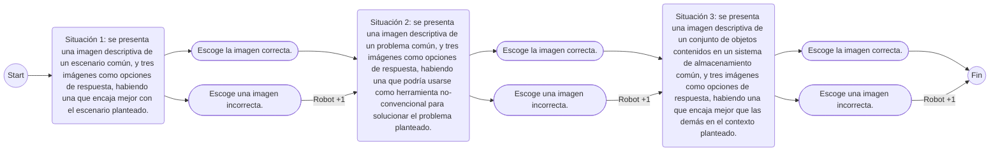

```mermaid
flowchart LR
B((Start)) --> 		B1(Situación 1: se presenta una imagen descriptiva de un escenario común, y tres imágenes como opciones de respuesta, habiendo una que encaja mejor con el escenario planteado.)
    				B1 --> 		B1h([Escoge la imagen correcta.]) 
								B1h --> B2(Situación 2: se presenta una imagen descriptiva de un problema común, y tres imágenes como opciones de respuesta, habiendo una que podría usarse como herramienta no-convencional para solucionar el problema planteado.)
    				B1 --> 		B1i([Escoge una imagen incorrecta.]) 
								B1i -->|Robot +1| B2
								
					B2 --> 		B2h([Escoge la imagen correcta.]) 
								B2h --> B3(Situación 3: se presenta una imagen descriptiva de un conjunto de objetos contenidos en un sistema de almacenamiento común, y tres imágenes como opciones de respuesta, habiendo una que encaja mejor que las demás en el contexto planteado.)
					B2 --> 		B2i([Escoge una imagen incorrecta.]) 
								B2i -->|Robot +1| B3
								
            		B3 --> 		B3h([Escoge la imagen correcta.]) 
								B3h --> End2((Fin))
            		B3 --> 		B3i([Escoge una imagen incorrecta.]) 
								B3i-->|Robot +1| End2
```
